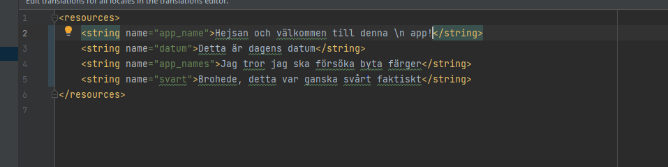

# Rapport

**Skriv din rapport här!**


Först så skapade jag ett Github konto, sedan Fork:ade jag "mobileapp-programming-hello", sedan så klickade jag på "project from version control". 
Efter så ändrade jag från "Hello world" till .... 


den enda koden jag har ändrat är färgerna: 
<?xml version="1.0" encoding="utf-8"?>
<resources>
    <color name="colorPrimary">#FFA07A</color>
    <color name="colorPrimaryDark">#E9967A</color>
    <color name="colorAccent">#FA8072</color>
</resources>
Koden över bestämmer vilka färger som visas i applikationen. Jag valde dock att använda "colorAccent" som bakgrundsfärgen också. 
 och texten som finns i skärmdumpen. 
## Följande grundsyn gäller dugga-svar:

```
function errorCallback(error) {
    switch(error.code) {
        case error.PERMISSION_DENIED:
            // Geolocation API stöds inte, gör något
            break;
        case error.POSITION_UNAVAILABLE:
            // Misslyckat positionsanrop, gör något
            break;
        case error.UNKNOWN_ERROR:
            // Okänt fel, gör något
            break;
    }
}
```

Bilder läggs i samma mapp som markdown-filen.


